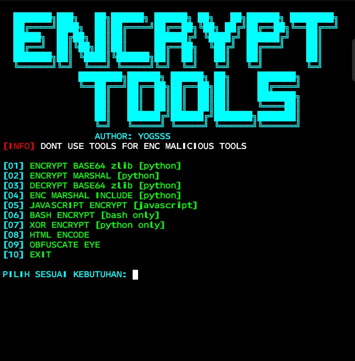

<p align="center">
  
</p>
 
<div align="center">

# 🔐 ENCRYPT TOOLS
"Amankan kode kamu dengan sekali klik."

<div align="center">


</div>

### 🛡️ Apa Itu ENCRYPT TOOLS?
**Encrypt Tools** adalah alat  untuk membantu proses enkripsi dan obfuscation pada berbagai bahasa pemrograman yang di kembangkan oleh **YOGSSS**

> **[INFO]** DONT USE TOOLS FOR ENC MALICIOUS TOOLS

---

# 🕯️ FITUR KEGELAPAN

| | |
| :--- | :--- |
| 🐍 | **[01] Encrypt Base64 zlib** — Python |
| 📦 | **[02] Encrypt Marshal** — Python |
| 🔓 | **[03] Decrypt Base64 zlib** — Python |
| 🛠️ | **[04] Enc Marshal Include** — Python |
| 📜 | **[05] Javascript Encrypt** — Javascript |
| 🐚 | **[06] Bash Encrypt** — Bash only |
| 🔀 | **[07] XOR Encrypt** — Python only |
| 🌐 | **[08] HTML Encode** |
| 👁️ | **[09] Obfuscate Eye** |
| ❌ | **[10] EXIT** |


---
# 🔥 cara menggunakan

file/tols yang kamu mau encrypt harus berada di folder
alat-enkripsi, untuk cara memindahkan 
file/tols yang mau di encrypt dengan cara
mv ~/nama file.py ~/alat-enkripsi/, untuk cara cek setelah file di pindahakan ke folder alat-enkripsi adalah dengan mengetik ls.file yang telah di encrypt menjadi, contoh main.py menjadi enc_main.py

### 🛠️ INSTALLASI
 ```bash  
1. pkg update && pkg upgrade -y
2. pkg install git python -y
3. termux-setup-storage
4. git clone https://github.com/artcasds/alat-enkripsi
